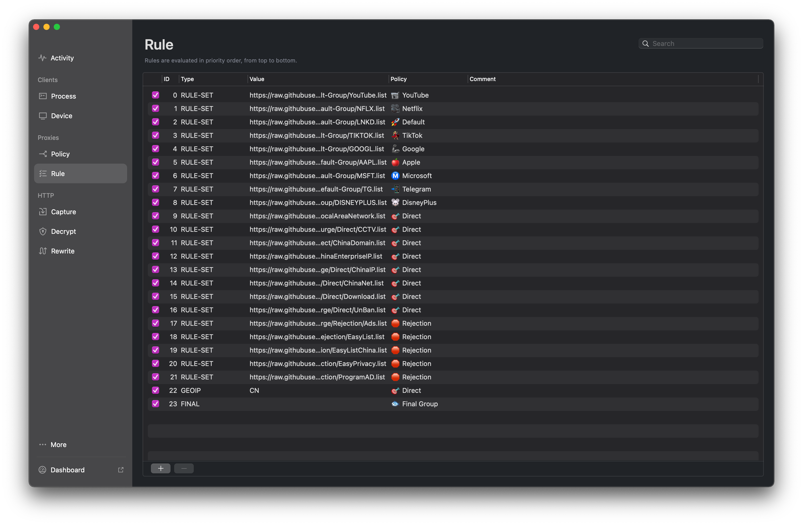

# Network-Proxy-Rules
This repo introduces how [@dykderrick](https://github.com/dykderrick) configures the network experience in China to meet basic requirements in the digital world. Derrick holds a view that if his network on every single piece of his electronic devices were not configured correctly, he'd rather live even without the Internet.

But most of the configurations here only adapts to the environment in China mainland, though some rules like ad-blocking or streaming service geo-location could also be used elsewhere.

## Before Getting Started
### Internet Speed
My girlfriend always laughed at me how nerd I am so into testing the speed, latency, jitter of the Internet service every time when I traveled to a new place and connected to a new Internet environment. But honestly what I am really fascinated, in retrospect, was not the speed itself, but what the speed of Internet could bring what level of entertainment (and productivity) to me. For example, when I watch YouTube videos, I always choose the highest video quality the YouTuber provides, because seeing the exact details of a video content makes me feel excited and I just love to see videos in a very sharp frame. However, if the Internet speed cannot satisfy, YouTube (or Netflix, or any other modern streaming platform) will throw me their Adaptive Bitrate (ABR) algorithms. I am not saying those bitrate adaptions are bad, because they kind of provide consumers a more fluent watching experience. But at the end of the day, I just do not want the quality of what I am watching jumps back and forth, ranging from 480p to 2160p or whatever it throws me in the next buffer. I would say it really disturbs me even worse than a low but stable quality, like 720p but continuously stable.

### Local Area Network
Honestly, most of the techniques I present here come from the experience of my daily Internet usage at home. China was once the world's first country to suffer from covid. Back in 2020, I planned to stay at home for just two weeks of Chinese New Year time, but that plan eventually ends of an extension to nearly seven months. Lockdown policy made me have no other choice but study from home. Attending Tencent Meeting preempts network bandwidth from other devices in the LAN frustrates me and all other family members here. So we contacted China Telecom to upgrade our broadband from 50Mbps to 200Mbps.

But things are not going as promising. Our house uses TP-LINK "square-like" access points for every room. Those APs are connected by a PoE network swtich to China Telecom modem. If our service plan is 50Mbps, then packets could flow smoothly and exchange data in these pipelines. But when we upgraded the service to 200Mbps, we found our Internet speed can only be restricted to 90Mbps maximum. At first I thought it was either China Telecom or the house provider's problem. But it turns out our network switch only supports 100Mbps data exchange. And the TP-LINK access point only supports 450Mbps maximum as their advertising says (but actually only 100Mbps). So we upgraded to a 1000Mbps switch and 1000Mbps APs. And now the service plan has also been upgraded to 500Mbps minimum and 800Mbps maximum. I would say this time we could struggle to survive for ten more years in the house for working from home and never lag behind the world. Maybe.

### Why Do We Need to Unblock Websites in China?
Great FireWall (GFW) somehow gives the ruler of China a more convenient way to manipulate the thoughts of Chinese netizens. I agree with the idea. Who doesn't want convenience?

However, those blockings are a nightmare for students. To be honest, in my first two years of college, I have no idea how to do appropriate academic researches, or even how to use a search engine to get answers for coding issues (Literally I can use Chinese developer community like CSDN to get answers. But in most cases, I cannot get the principles or reasons behind the issues). Not to mention some of the coding issues are caused by the GFW itself. For example, if we use Android Studio to build an Android app, we would use Gradle to manage packages. But thanks to the block of Google in China, packages located on the Google server cannot be downloaded to the app bundle. Even if the deployment environment uses HTTP proxy, some operating system calls fail to obey such proxy rules (**See Also:** [Surge Manual](https://manual.nssurge.com/book/understanding-surge/en)). In this case, some system environment configurations will fail. For example, if a python script imports a specific module your local python environment doesn't have, probably you'd use a command like `pip install foo`, which actually calls download service at PyPI. If no proxy is enabled, this download process could become extremely slow. No productive at all.

Another reason to unblock websites is to learn English. That is ironic, right? Actually I didn't like to use YouTube until I started preparing for TOEFL and GRE in my third year of college. At that time, I realized I was literally ruined by the K-12 English education in China. Gao Kao could never give me the correct method to learn a specific language at all. In retrospect, how could you like to learn English if all of your knowledge about English is filled with choosing something from four choices? Not to mention the practice of speaking. No opportunities at all. As a result, I started to follow some YouTubers, Podcast creators, and Netflix TV series to re-learn English. This period of time made me realize that living in an English environment is the correct way to learn this language, instead of taking one or two English exams per day.

## Configuration Basics
This section hosts Derrick's very deployment and configuration details.

### What If I Am REALLY Not Interested in Network Configuration?
Actually, many of my friends do not know how networking works but they just want a solution to have a basic access. In that circumstance, I prefer to recommend you [**ExpressVPN**](https://www.expressvpn.com).

### JiChang 机场 機場
If you are new to Simplified Chinese Internet community, this word may be very confusing at first, but interesting and unique to be even exist legimately somehow in China mainland if you gradually adapt to cross the GFW. To put it simple, a 机场 is operated by maybe a Chinese guy that has plenty cloud resources. This Chinese seller can be either a computer networking geek or a zero coding experience merchant. At the end of the day though, the owner of a 机场 provides specific services for Chinese netizens to cross the GFW. The services right now are range from vmess, shadowsocks, Trojan, or other point-to-point communication protocols. They do not provide administrative privileges to buyers but they do promising 7/24 operating those resources. Choosing 机场 could be a double-edged sword. You can enjoy zero worries on censorships, operatings or management because they already take all of them. But you do lose the data privacy like your browsing history to those guys.

For me, I have to say in my years of networking configuration experiences, I choose to embrace both 机场 and self-deployed cloud servers. I leave those irrelavant streaming service like Netflix, Disney+ traffic to 机场, and keep personal browsing history to my own cloud servers. I think this selection is a compromise between convenience and privacy.

So, for the 机场 selection, I use https://teacat.cloud and https://fastlink.ws. The former service provider uses shadowsocks so any UDP connections can be proxied as well as TCPs. The later promises to provide local IP tunnels which means Netflix non-originals are also supported.

### Cloud
I had a [DigitalOcean](https://digitalocean.com) Linux server that runs a basic v2ray service. This server could provide me with an IPv6 address so that I can visit [BYRBT](https://byr.pt) directly from my home, where no IPv6 address is provided by my local ISP.

(**Modified**) But now I switch to Microsoft Azure, because the free $100 discount for DigitalOcean droplets runs off 😂. Fortunately Azure offers to provide another $100 discount, so I could continue to use it then.

Also, this time I started to deploy Shadowsocks and Snell on the server instead of vmess, considering its ability to relay UDP connections.

### Software

**Surge** for Mac and for iOS is highly recommended. Official website https://nssurge.com and Docs at https://manual.nssurge.com/book/understanding-surge/en.
#### What if I do not have a Mac?
Buy it.

### Rules and Policy Groups
* **Unfinished**.
